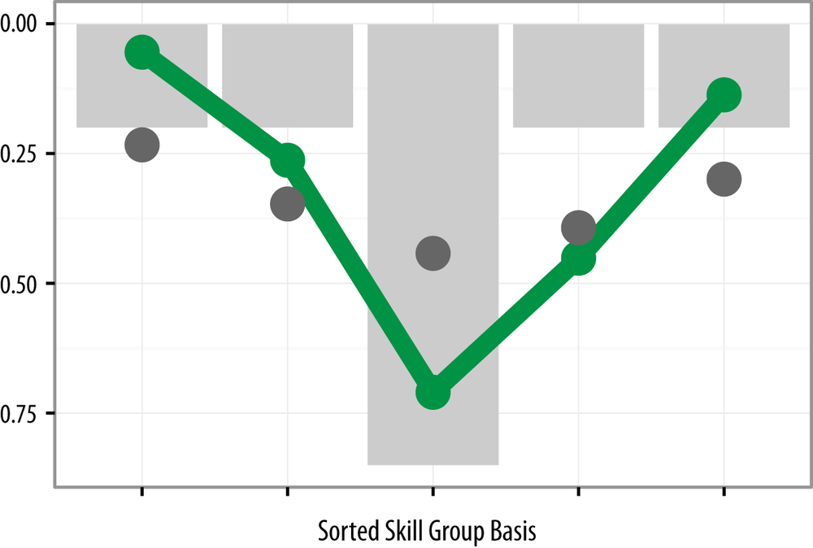

Data Science is a young, growing field. It’s a field where if you’re new, you’re not sure whether to be a specialist or a generalist and if you’re already in the field, new tech comes along so often making it hard to figure out what skills you need to maximize your chances long-term?

It’s a field where you can find job descriptions of a dizzying variety, so let’s look at 2 here (pseudo-randomly selected from postings in NYC) to set the scene:

1. **Data Scientist, Engagement ([WeWork](https://www.glassdoor.com.au/job-listing/data-scientist-engagement-wework-JV_IC1132348_KO0,25_KE26,32.htm?jl=3163574821&ctt=1553403465647))**  
   
***Firstly, the responsibilities***. Work with stakeholders in product, engineering, business, etc. Design, launch, monitor and evaluate A/B testing. Drive inferences from quantitative data.
   
***Secondly, your requirements***. 3–5 Years of experience. **Strong** of statistical methods. **SQL**. **Python** or **R** for exploration, analysis, **visualization**. Further experience with **visualization** with Looker, Chartio, **Tableau**. Various other **Soft Skills** mentioned throughout.***Nice to haves***. Quantitative Degree. **Product Analytics**. 

Would you be using Deep Learning/Tensorflow/PyTorch? Probably Not.Would you be setting up data pipelines and data engineering? Nope.If I were to hazard a guess at to what you’d potentially be doing here, it sounds a lot like product analytics. 

Get some visualizations going, talk to users, maybe design some A/B testing and give the product a better insight into the product(whatever that maybe, an app, website, etc.)A strong basis in inferential statistics (Maybe Bayesian but it’d probably be wasted here) would benefit you far more than experience in Kaggle competitions using Tensorflow. If you prefer talking to people, being in meetings, managing expectations and explaining those statistical ideas you have in simple terms , you’d probably do better than if you’re the quiet genius working away at a 16 page scientific paper.

2. **Data Scientist, Personalization ([Spotify](https://www.glassdoor.com.au/job-listing/data-scientist-personalization-spotify-JV_IC1132348_KO0,30_KE31,38.htm?jl=2624838662&ctt=1553405229112))** 
   
***Firstly, the responsibilities***. Find out **who** Spotify listeners are, **how** they get value out of Spotify, and **where** Spotify can **develop product** to bring **greater value to users**. Perform **exploratory** analysis for insight into **performance** of machine learning systems. **Communication** with other analytics professionals and Data Scientist.

***Secondly, your requirements***. 2–5 Years of experience. Coding skills such as **Python** or **R**. Further experience with **visualization,** including usage of **SQL,Tableau**. Experience with **Large Datasets**. Strong understanding of **Metrics Development and Testing Methodologies**. Independent thinker and a communicative **Mentor**.***Nice to haves***. Good taste in music?Here you would be better off knowing Machine learning and statistics. 

Here it is far more advisable for you to have been in Kaggle competitions and know your way around metrics of model performance.

Now I wouldn’t obviously know what these jobs require since I don’t work at either companies nor do I know the hiring managers, and I would recommend you to first reach out and talk to the companies before making rash generalization like I did just there. The purpose of this exercise was just to highlight the vast difference of skills you might need for a job posting that has the same range of 2–5 years experience, both titled “Data Scientist”.

Naturally, this has lead to prominent and not so prominent people in the community (like yours truly!) to pontificate on what it means to be a Data Scientist and where is the industry going in the future. It is quite a confusing time to be starting if you’ve got no idea how to get into the “Sexiest Job of the Century”. So what do you do?

You do your research of course! You start reading about [Why you shouldn’t be a data science generalist](https://towardsdatascience.com/why-you-shouldnt-be-a-data-science-generalist-f69ea37cdd2c) and then you read [Why you should be a data science generalist](https://www.datasciencecentral.com/profiles/blogs/why-you-should-be-a-data-science-generalist). Thanks Data Science Community for clearing that one up!

Ok, apologies again for being a sensationalist and implying no one knows what’s going on. Both articles mention the fractured nature of “Data Science Community” and both have great advice depending on who you are, which is why I recommend reading both before continuing here. Seriously.
 For example, I can use the soft skills and the business impact described by Vincent Granville ([Generalist advocate in this case](https://www.datasciencecentral.com/profiles/blogs/why-you-should-be-a-data-science-generalist)) to describe both of the job descriptions above. But I can also use a mixture of job specializations used by [Jeremie Harris](https://medium.com/u/59564831d1eb?source=post_page-----4c386d9ad177--------------------------------) ([the specialist advocate in this case](https://towardsdatascience.com/why-you-shouldnt-be-a-data-science-generalist-f69ea37cdd2c)) to describe each of the jobs above (Eg. The WeWork is an example of Analyst & Data Scientist where Spotify is Data Scientist & Machine Learning Engineer/Researcher).

Where I would vote for refinement of arguments in each article is by introducing the T-Shaped professional. A T-Shaped data professional has specializations, but is also able to contribute and be aware of discussions in the other areas of this wide realm we call Data Science. The T-Shaped data scientist has actually been promoted often, here in an O’Reilly Report in 2013 (over a decade ago when Frozen was first released).

[Analyzing the Analyzers by Harlan Harris, Marck Vaisman, Sean Murphy ( O’Reilly Media, Inc.)](https://www.oreilly.com/library/view/analyzing-the-analyzers/9781449368388/)

What’s changed here is that we’ve started getting more granular with the skills you need. Previously, in that report, the specializations were identified as “Data Businessperson”, “Data Creative”, “Data Researcher” and, “Data Developer”. These are broad, general terms that don’t necessarily help distinguish between the first and second job posting mentioned above. If we’re sticking with [Jeremie Harris](https://medium.com/u/59564831d1eb?source=post_page-----4c386d9ad177--------------------------------) ’s specializations, a T-Shaped Data Engineer based on someone I know,work with and have immense respect for (Hi ***[@wjokent](https://twitter.com/wjokent)***) would look like the following:

- **Deep Expertise Categorization :** Data Engineer
- **Deep Expertise Toolkit:** SQL, ETL Processes, Familiarity with Data Storage technologies and architectures (AWS, GCP). Simply put, I know where and how to handle Terabytes of data, model it, process it where necessary and expose it for various other professionals.
- **Broad Expertise Knowledge and Toolkit:**
  - **Basic statistics. Why it matters:** I know how to determine a decent sample size, I can perform basic descriptive stats to know if a data set is potentially representative of the question.
  - **Product knowledge.Why it matters:** When business users or other members of the team ask questions regarding data availability and accessibility, I know our product metrics enough to advise them.
  - **Machine Learning.Why it matters:** I can be an authoritative source on the availability, shape and quality of data for machine learning projects. As part of the team, my knowledge and experience can ensure the setup for Continuous Integration and Deployment environment. Also, given that most of time spent in Machine Learning is in the data cleaning and processing step, my strong ETL knowledge allows for feature engineering which researchers might not even have dreamt off.
  - **Business Analytics.Why it matters:** Business analytics is a bit general here, being used to describe both metric development as well as requirement gathering. Being able to know which features can move which metrics, I can hone down and help focus the team’s attention on solutions which deliver the most impact in the shortest amount of time as well as help business users understand the complexities behind our infrastructures.

I myself am striving to be a T-Shaped Professional. The beauty of approaching a career in this lens is that it takes away the entire “Generalist” Vs. “Specialist” lens and allows for what I consider more important career considerations. Things like organization and team size, utilization of your soft skills and how can you make the most **impact**.

Data Science is one of the few interdisciplinary fields which can always use specialists with a broad general knowledge, and a specialization that brings a unique flavor to the formula. Some of the best Data people I’ve met have come from a completely different field, and it’s their diversity that allows them to innovate and push the boundaries of the field.

I’d love to know what you think and always open to DMs [@rezansafari](https://twitter.com/rezansafari).